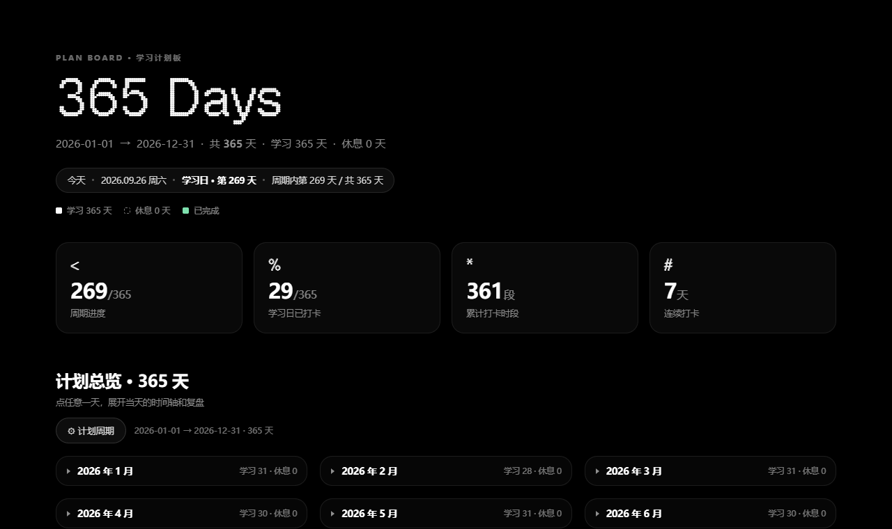
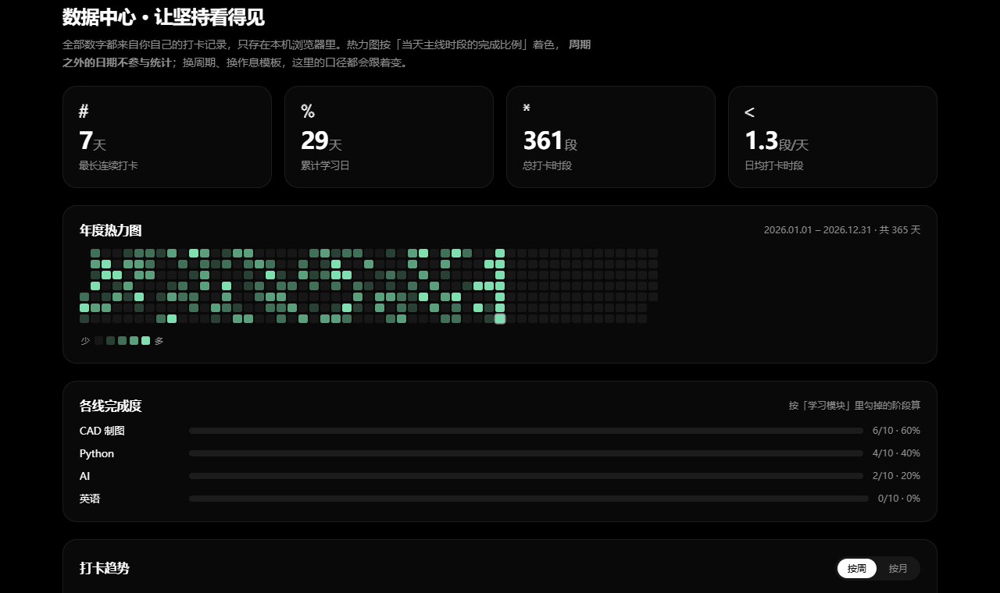
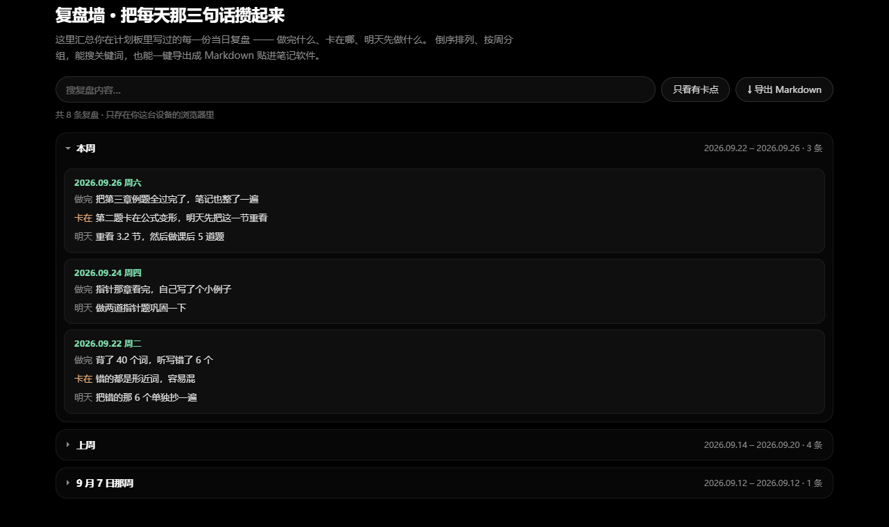
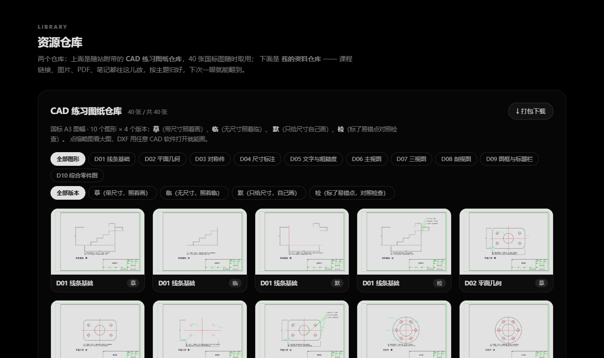

# 学习计划板 · study-website

> 一个**纯前端、零依赖、零账号**的自定义学习计划板 —— 自己定周期、自己排每日作息、自己加学习模块，顺带自带 40 张国标机械制图练习图纸。
> **整站不发起任何外部请求，拷到 U 盘里断网也能用。**
>
> A dependency-free, fully offline study planner. Define your own period, schedule, and modules — plus 40 GB/T mechanical-drawing blueprints.



---

## 这是什么

大部分学习类 App 都替你决定好了：周期是一个月，模块是「语文数学英语」，打卡格子是固定的。
这个站点反过来 —— **它只提供一个骨架，内容全部由你填。**

- 周期不是「13 天」，而是**你想多长就多长**：几天、一个学期、一整年都行，默认取「今年 1/1 → 12/31」；
- 每天几点做什么，是**可编辑的时段模板**，学习日和休息日各一套；
- 要学的东西是**模块**，模块下是**任务**，模块和任务都能增删改；
- 出厂自带的四条线（专业课 / Python / AI / 英语）**只是起步模板，不是规定** —— 全都可以换掉。

---

## 核心特性

### 1. 周期完全自定义

| 能力 | 说明 |
|---|---|
| 起止日期 | 任选，非法区间（如 `2/30`、结束早于开始）会被挡下并提示原因 |
| 默认周期 | 打开就是「今年一整年」，闰年自动 366 天，跨年自动跟着变 |
| 一键快取 | 今年 / 明年 / 本月 / 本季度 / 本季 |
| 休息规则 | **默认不预设任何休息日**，哪天休由你自己勾；节假日可加「额外休息日」；补班可加「调休学习日」 |
| 实时预算 | 改一个数，学习天数 / 休息天数当场重算 |

### 2. 年历按月分块，可折叠

12 个月各自成块，块头显示「学习 N 天 · 休息 N 天」。默认只展开今天所在的那一个月 ——
一年 365 格不会一次全糊在你脸上。点块头折叠 / 展开，展开状态会被记住。

### 3. 每日作息是一个可编辑模板

学习日一套、休息日一套。每条时段可以：

- 改时间、改标题、改说明
- 选**类型**：主线 / 轻量 / 自由 / 作息（只有「主线」计入当天完成度）
- 上下移动、删除、新增

删掉某条时段时，会连带清掉该时段在**所有日期**上的打卡记录 —— 不会留下孤儿数据。

### 4. 模块与任务

模块可以增删改、换图标、换颜色；任务可以增删、排序、打标签。
**任务不绑日期** —— 它属于一个阶段，不是一个「13 天示例」里的某一天。

### 5. 打卡与指标

点任意一天展开当天时间轴，按时段打卡。四个指标全部跟着你的周期走：

- **周期进度** —— 已过天数 / 总天数
- **学习日已打卡** —— 已打卡的学习日 / 学习日总数
- **累计打卡时段** —— 所有已勾选的时段条数
- **连续打卡** —— 从今天往前数的连续天数

### 6. 数据中心 —— 让坚持看得见



所有数字都从你已有的打卡记录推导，**不额外存任何东西**：

- **年度热力图** —— 365 格、一列一周，按「当天主线时段的完成比例」分 5 档着色；周期之外的日期不参与统计
- **四个关键数字** —— 最长连续打卡 / 累计学习日 / 总打卡时段 / 日均打卡时段
- **各线完成度** —— 每条学习线勾掉了多少阶段，进度条 + 百分比
- **打卡趋势** —— 累计打卡时段按周或按月聚合，可随时切换
- 点热力图上的任意一格，直接跳到那天的安排

### 7. 复盘墙 —— 把每天那三句话攒起来



计划板里每天写的「做完什么 / 卡在哪 / 明天先做什么」，在这里自动汇总成一份可累积、可带走的记录：

- **倒序流 + 按周分组**，最近一周默认展开
- **关键词搜索**，命中处高亮
- **只看有卡点** —— 把当时卡住的地方单独捞出来看
- 点任意一条，跳回计划板并展开那天
- **一键导出 Markdown** —— 按周分节、带日期区间，直接贴进 Obsidian / 语雀 / 飞书

### 8. 内置资源仓库



**A. CAD 练习图纸仓库（随仓库分发）**

40 张 DXF 图纸 = 10 个图形 × 摹 / 临 / 默 / 检 四个版本，按国标 **GB/T** 出图、**第一角投影法**：

| 编号 | 图形 | 编号 | 图形 |
|---|---|---|---|
| D01 | 线条基础 | D06 | 主视图 |
| D02 | 平面几何 | D07 | 三视图 |
| D03 | 对称件 | D08 | 剖视图 |
| D04 | 尺寸标注 | D09 | 图框与标题栏 |
| D05 | 文字与粗糙度 | D10 | 综合零件图 |

- 按**图形**筛选 + 按**版本**筛选，两个条件可叠加
- 点缩略图看大图
- 单张下载 DXF，或点「打包下载」一键拿到全部 40 张（**零依赖打包**，不引入任何 ZIP 库）
- DXF 用任意 CAD 软件都能打开：AutoCAD、中望 CAD、LibreCAD、FreeCAD…

**B. 我的资料仓库（用户自己的）**

- **加链接**：存网课、文档、笔记的网址。链接会跟「导出 JSON」一起走，换台电脑也还在。
- **加文件**：图片 / PDF / 文档，直接拖进来。存在浏览器本地（IndexedDB），**不上传、不联网、不进 JSON**。
- 入库前会过一道协议白名单，`javascript:` / `data:` / `vbscript:` / `file:` 一律拦下。

### 9. 导入 / 导出

「导出 JSON」把**周期 + 时段模板 + 模块 + 任务 + 打卡记录 + 复盘 + 笔记 + 链接**全部导出成一个文件；
「导入 JSON」可以整体还原。导入前有确认框，避免手滑覆盖。

导出过一次之后，程序会记住时间；超过 14 天没再导出、而且已经有打卡记录时，计划板顶部会提醒你备份一次。

---

## 快速开始

**方式一：直接打开。**

双击 `index.html` 就行。没有构建步骤，没有依赖安装，没有后端。

**方式二：起个本地服务器**（推荐，`file://` 下 IndexedDB 行为和 `http://` 略有差异）：

```bash
# 任选一种
python -m http.server 8080
npx serve .
```

然后访问 `http://localhost:8080`。

**方式三：丢到静态托管。** 全部用相对路径，不需要改一行代码 ——
GitHub Pages、Cloudflare Pages、Netlify、Vercel、任意对象存储都可以。

---

## 桌面快捷方式（带图标）

想双击桌面图标直达？项目自带图标文件 `assets/icon/study-website.ico`（另有 `icon-1024.png` / `icon-256.png`，想用在别处直接拿）。

**Windows**

1. 右键桌面 → 新建 → 快捷方式
2. 位置填 `index.html` 的完整路径（或本地服务器地址）
3. 右键这个快捷方式 → 属性 → 更改图标 → 浏览选中 `assets/icon/study-website.ico`

**macOS**

1. 选中 `index.html`，`⌘ + Option` 拖到桌面生成替身；或浏览器打开后「更多工具 → 创建快捷方式」

> 浏览器标签页 / 收藏夹里的图标（favicon）已经指向同一套图标，风格是一致的。

---

## 数据存在哪 / 隐私

这个站点**没有后端、没有账号、没有埋点**。全项目只有 **1 个 `fetch()`**，抓的是本地 `assets/dxf/*.dxf`。

| 数据 | 存储位置 | 会不会出网 |
|---|---|---|
| 周期 / 时段 / 模块 / 任务 / 打卡 / 复盘 / 笔记 / 链接 | 浏览器 `localStorage`（键名 `study-plan-v2`） | 否 |
| 你上传的图片 / PDF / 文档 | 浏览器 `IndexedDB`（库名 `study-site-repo`） | 否，也不进导出的 JSON |
| 图纸浏览 | 本地静态文件 | 否 |

换台电脑：导出 JSON 带走计划；上传的私人文件**故意**不跟着走。
所有用户输入渲染前都过转义，已用真注入用例验过。

**页面不发起任何外部请求。** 不加载 CDN 字体、不加载图标字体、不加载视频 ——
正文走系统字体栈，标题用仓库自带的 `fonts/GeistPixel-Circle.woff2`，图标是内联 SVG，
首屏背景是本地 Canvas 绘制的点阵动效。把整个文件夹拷进 U 盘、拔掉网线打开，功能与视觉一模一样。

**备份提醒**：数据只在本机浏览器里，清缓存就没了。所以当你超过 14 天没导出、且已经有打卡记录时，
计划板顶部会出现一条**可关闭**的温和提示 —— 不弹窗、不打断；关掉之后安静 30 天。

---

## 怎么把它变成你自己的

1. **定周期** —— 点「⊕ 计划周期」，改起止日期，勾休息日，加节假日 / 补班日期，应用。
2. **改作息** —— 点「编辑计划」，在当天时间轴里增删改时段，给每条选类型。
3. **换模块** —— 同样在编辑模式下，模块可以增删改；任务也一样。
4. **加资料** —— 在资源仓库里加链接或拖文件。
5. **导出备份** —— 随时「导出 JSON」，换设备 / 换浏览器都能还原。

---

## 目录结构

```
.
├── index.html                  # 页面结构（单页）
├── main.js                     # 全部逻辑（vanilla JS，无框架）
├── styles.css                  # 全部样式（含深色主题与移动端断点）
├── .gitignore
├── .gitattributes
├── LICENSE                     # MIT + 第三方资源授权附表
├── README.md
├── assets/
│   ├── logo.webp
│   ├── icon/                   # 站点图标（ico + png，桌面快捷方式用）
│   ├── readme/                 # README 用的四张截图
│   └── dxf/                    # 40 张 DXF + 40 张预览 PNG
└── fonts/
    └── GeistPixel-Circle.woff2 # 点缀字体（SIL OFL）
```

---

## 技术说明

- **零依赖、零构建**：没有 npm 包、没有打包器、没有框架。三个文件就是全部。
- **零外部请求**：字体、图标、背景全部本地化 —— 正文系统字体栈、标题本地 woff2、图标内联 SVG、
  首屏背景本地 Canvas。断网可用，不是口号。
- **首屏点阵是 Canvas 画的**：一片缓慢呼吸的点阵，从中心向外走一圈环形波。不加载视频、不加载图片，
  标签页切到后台或首屏滚出视野就暂停；`prefers-reduced-motion: reduce` 时只画一帧静态点阵。
- **零依赖 ZIP**：手写 stored（不压缩）ZIP —— CRC32 查表、local header、central directory、EOCD，
  文件名带 UTF-8 标志位 `0x0800`。所以「打包下载 40 张图」不需要引任何库。
- **事件委托**：容器上装一次监听，`innerHTML` 整体替换也不会让交互失效。
- **自建模态框**：不用 `window.confirm` / `prompt` —— 一是样式可控，二是能被无头浏览器自动化验证。
- **日期处理**：严格解析 `YYYY-MM-DD`，`2026-02-30` 这类会被拒而不是静默进位成 3/2。
- **周期推导层**：`thisYearPeriod() → period() → days()`，带 1500 天护栏与缓存失效。
- **无障碍 / 动效**：尊重 `prefers-reduced-motion`；移动端 390px 无横向溢出。

---

## 第三方资源

**运行时没有任何第三方资源。** 页面不加载外部字体、图标或视频，全部本地化：

| 用途 | 用什么 |
|---|---|
| 正文 | 系统字体栈（`system-ui` / `Segoe UI` / 苹方 / 微软雅黑…），不发请求 |
| 标题（点阵显示字体） | 仓库自带的 `fonts/GeistPixel-Circle.woff2`，SIL OFL |
| 图标 | 内联 SVG（三个，手写在 `index.html` 里） |
| 首屏背景 | 本地 Canvas 绘制的点阵动效 |

v0.1.x 曾引用 Google Fonts（Inter）、Font Awesome CDN、Bubbledot ICG 在线字体与一段 CloudFront 背景视频；
**v0.2.0 已全部移除**。历史清单与各自授权见 [`LICENSE`](./LICENSE) 附表。

> 应用内有 4 个**纯文本超链接**（Python 官方中文文档、廖雪峰 Python 教程、《动手学深度学习》、Kaggle Learn）——
> 只是可点击的网址，不会随页面加载而发起任何请求。

---

## 关于那 40 张图纸

- 依据中国国家标准绘制：GB/T 14689（图幅）、GB/T 4457.4（图线）、GB/T 4458.4（尺寸注法）、
  GB/T 10609.1（标题栏）、GB/T 14691（字体）。
- 标题栏「设计」栏填的是通用占位「学生」，不含任何个人信息。
- 图纸以 DXF + PNG 两种格式**预生成**后随仓库分发；生成器依赖作者本机的制图工具链，未随仓库提供。
  想改图形或尺寸，直接用 CAD 打开 DXF 编辑即可。

---

## 许可

[MIT](./LICENSE) —— 随便用，包括商用。第三方资源各自的授权见 LICENSE 附表。
